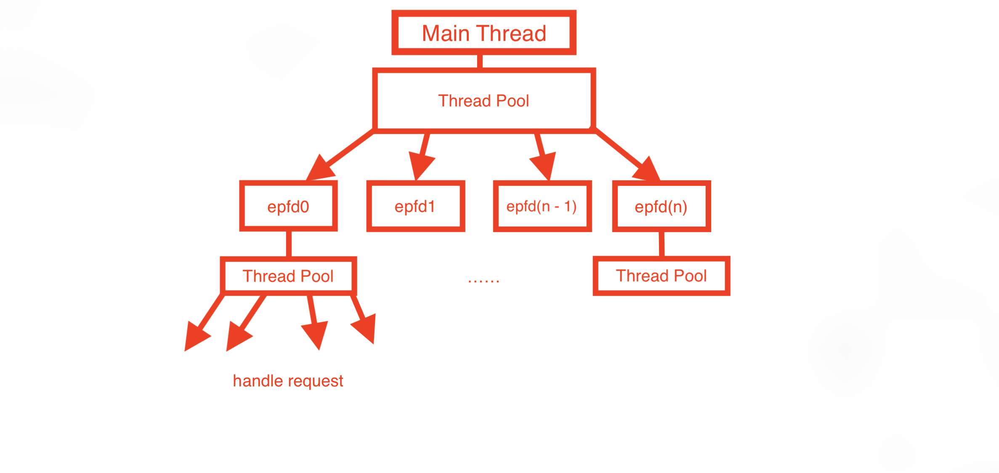

# RPCFramework

## 架构概述

该RPC框架包括以下组件：

- **Procedure.hpp**: 封装了「过程」的名称和参数 
- **ReturnPacket.hpp**: 封装了返回结果
- **Serializer.hpp**: 工具类，用于序列化和反序列化对象
- **RPCFramework.hpp**: RPC 框架类，是 RPC 的核心
- **RPCServer.hpp**: 服务端类，使用 ThreadPool + epoll 实现
- **RPCClient.hpp**: 客户端类，有一个核心模版成员函数 `remoteCall`

## 功能与特点

### 框架部分

- 使用 **模版元编程** ，支持注册任意普通函数、std::function 对象、类成员函数
- 使用 Serializer 类来实现任意对象的 **序列化和反序列化**

### 服务端部分

- 使用 **ThreadPool + epoll** 处理客户端的请求
- 使用 std::priority_queue 实现简单的 **负载均衡**
- 使用 shared_ptr 管理客户端套接字，确保连接正确释放
- 使用 log4cplus 记录日志

## 示例

示例代码已经放在 `RPCFramework/Example` 中

### 服务端

```cpp
#include "RPCServer.hpp"
#include "TestClass.hpp"
#include "Procedures.hpp"


int main(void)
{
    RPCServer server("192.168.124.114", 1145, 60000);

    std::function<int(int, int)> add = [](int a, int b)
    {
        return a + b;
    };
    std::function<void(int)> show = [](int a)
    {
        std::cout << a << std::endl;
    };

    server.registerProcedure("add", add);                 // 测试对 std::function 对象的支持
    server.registerProcedure("sub", sub);                 // 测试对函数指针的支持
    server.registerProcedure("show", show);               // 测试对 void 返回类型的支持
    server.registerProcedure("func1", func1);             // 测试对嵌套函数的支持
    server.registerProcedure("hello", hello);             // 测试对 std::string 返回类型的支持
    server.registerProcedure("getHeXin", getHeXin);       // 测试参数、返回值类型为自定义类型的情况
    server.registerProcedure("testString", testString);   // 测试参数中含有 std::string 的情况
    server.registerProcedure("testExcp", testExcp);       // 测试在函数中，抛出异常的情况
    server.registerProcedure("testTimeOut", testTimeOut); // 测试函数运行时间过长的情况

    Foo foo;
    server.registerProcedure("Foo::test1", foo, &Foo::test1); // 测试对成员函数的支持

    server.start(); // 服务器，启动！
}
```

观察示例代码发现：

- 易于使用，只需要提供「过程」的名称，以及「过程」，就可以轻松注册

### 客户端

```cpp
#include <iostream>
#include "People.h"
#include "RPCClient.hpp"

// 测试基本功能
void testBasicFeature(const std::string& ip, uint16_t port)
{
    RPCClient clnt(ip, port);
    try
    {
        std::cout << clnt.remoteCall<int>("add", 1, 1) << std::endl;                                              // std::function
        std::cout << clnt.remoteCall<int>("sub", 1, 1) << std::endl;                                              // normal function
        clnt.remoteCall<void>("show", 114514);                                                                    // void return type
        clnt.remoteCall<void>("func1");                                                                           // void return type, no parma
        std::cout << clnt.remoteCall<int>("Foo::test1", 1, 17) << std::endl;                                      // member function
        std::cout << clnt.remoteCall<std::string>("hello") << std::endl;                                          // std::string return typr
        clnt.remoteCall<void>("testString", 1, std::string("hello, server!"), 1.1, std::string("RPC Framework")); // std::string parma

        People HeXin;
        HeXin = clnt.remoteCall<People>("getHeXin", HeXin); // Parameters and return types are custom types
        std::cout << "name: " << HeXin.name << ", age: " << HeXin.age << ", BinZhou: " << HeXin.BinZhou << std::endl;

        std::cout << clnt.remoteCall<int>("testTimeOut") << std::endl; // long time consuming task
        clnt.remoteCall<void>("excp");
        clnt.remoteCall<int>("niubi");
    }
    catch(const std::exception& e)
    {
        std::cerr << e.what() << '\n';
    }
}
```

可以发现，向服务端请求调用，只需要提供「过程」的名称，以及对应的参数即可

## 测试

完整的测试代码均在 `RPCFramework/Example/` 下

注意编译的时候，C++ 标准大于等于 C++14，并且链接 log4cplus 和 pthread 库

## 注意事项

对于自定义类型，需要重载 `operator<<` 和 `operator>>`，并且在重载的时候，需要保证 `<<` 和 `>>` 的方式一致，例如，对于自定义类型 People：

```cpp
class People
{
public:
    std::string name;
    int age;
    std::string BinZhou;

    People() = default;

    friend std::istream &operator>>(std::istream &is, People &people)
    {
        // 自定义的对象类型必须正确读入字符串对象（主要是空格问题)
        // 这里规定所有的字符串对象都不包含 ' 字符
        std::string temp;
        auto parseTo = [&temp](std::string &target) -> int
        {
            if(temp.find('\'') != std::string::npos)
            {
                size_t start = temp.find('\'');
                size_t end = temp.find('\'', start + 1);
                if(end == std::string::npos)
                    return -1;
                target = std::move(temp.substr(start + 1, end - start - 1));
            }
            else target = std::move(temp);
            return 0;
        };

        std::getline(is, temp);
        if(parseTo(people.name) == -1)
            throw std::runtime_error("姓名不合法！输入的姓名为：" + temp);
        
        is >> people.age;
        if(!is)
            throw std::runtime_error("输入年龄不合法！");
        is.seekg(1, std::ios::cur);

        std::getline(is, temp);
        if(parseTo(people.BinZhou) == -1)
            throw std::runtime_error("宾周不合法！输入的宾州为：" + temp);

        return is;
    }

    // 重载的 << 运算符的输出规则必须与 >> 运算符的输入规则一致，否则序列化错误
    friend std::ostream &operator<<(std::ostream &os, const People &people)
    {
        os << people.name << "\n" << people.age << "\n" << people.BinZhou;
        return os;
    }
};
```

在测试并发量时，需要保证 Server 的 backlog 足够大，以及系统的文件描述符限制：

```cpp
RPCServer server("192.168.124.114", 1145, 60000); // backlog == 60000
```


这种情况下，即使 backlog 为 60000，理论上同时连接的客户端最大数量也不能超过 4096（实际上，会更少，因为标准输入、标准输出、服务器套接字、epoll 实例等会占用一部分文件描述符）

----

接下来的部分主要是对代码的关键部分的解释

## 过程参数的保存

客户端向服务器发出的请求，实际上就是序列化后的一个「参数包」

该「参数包」包含两部分内容：

- 过程的名称
- 传递的参数

其中，由于传递的参数可能具有多种类型，因此，使用 tuple 保存

```cpp
template <typename ...Args>
struct ProcedurePacket
{
    std::string name; // 过程的名称
    std::tuple<Args ...> t; // tuple 用于保存传递的参数

    ProcedurePacket() = default; // 缺陷：Args 不能包含引用类型的参数

    ProcedurePacket(const std::string &name, Args... args)
        :name(name), t(std::make_tuple(args...)) {}

    template <typename ...X>
    friend std::ostream& operator<<(std::ostream &os, const ProcedurePacket<X ...> &packet);

    template <typename ...X>
    friend std::istream& operator>>(std::istream &is, ProcedurePacket<X ...> &packet);
};
```

## 支持任意函数（包括 void 返回类型）的实现

### procedures 成员变量

为了不让我们的 RPCFramework 类成为模版类，在存储「过程」的时候，就不能使用模版

例如：

```cpp
template <typename R, typename Args>
std::unordered_map<std::string, std::function<R(Args ...)>> procedures;
```

如果 RPCFramework 包含这个成员的话，就成为模版类了

因此，正确的成员声明如下：

```cpp
std::unordered_map<std::string, std::function<std::string(const std::string&)>> procedures;
```

其中，存储的「过程」为 `std::function<std::string(const std::string&)>`

- 参数是客户端传过来的序列化后的数据
- 返回值是将调用结果序列化后的数据

### registerProcedure 成员函数

该成员函数用于注册一个「过程」，第一个参数是「过程」的名称，第二个参数是一个模版参数，即「过程」

当然，为了实现对成员函数的支持，还重载了一个版本，该版本多了一个参数，用于保存是哪个成员

registerProcedure 成员函数的主要作用是：**将「过程」绑定到 `callProxy` 成员函数上**

```cpp
// bind callProxy 的函数指针，记得传入 this 指针，因为 callProxy 不是静态的
procedures[name] = std::bind(&RPCFramework::callProxy<Func>, this, procedure, std::placeholders::_1);
```

### callProxy 成员函数

该成员函数实际上是一个中间件，是 `registerProcedure` 到 `callProxyHelper` 的桥梁

```cpp
template <typename Func>
std::string RPCFramework::callProxy(Func f, const std::string &req)
{
    return callProxyHelper(f, req);
}
```

### callProxyHelper 成员函数

该成员函数是实现 **支持任意「过程」的关键**

它有三个重载版本，分别对应了三大类「过程」：

```cpp
template <typename R, typename ...Args>
std::string RPCFramework::callProxyHelper(std::function<R(Args ...)> f, const std::string &req);

template <typename R, typename ...Args>
std::string RPCFramework::callProxyHelper(R(*f)(Args ...), const std::string &req);   

template <typename R, typename Obj, typename ...Args>
std::string RPCFramework::callProxyHelper(Obj &obj, R(Obj::*f)(Args...), const std::string &req);
```

可以看出：callProxyHelper 实现了将 callProxy 中抽象的「过程」f 转换为了一个详细的「过程」，包含了返回值类型 `R`、参数列表 `Args...`

而函数体中包含了一个工具函数 invoke，用于调用「过程」 f

### invoke 工具函数

```cpp
// 调用中间件，当 R 不为 void 时，调用该版本
template <typename R, typename Function, typename Tuple>
typename std::enable_if<!std::is_same<R, void>::value, typename RetType<R>::type>::type
invoke(Function &&f, Tuple &&tuple)

// 当 R 为 void 时，调用该版本，返回 0（占位，无实际意义）
template <typename R, typename Function, typename Tuple>
typename std::enable_if<std::is_same<R, void>::value, typename RetType<R>::type>::type;
```

该工具函数有两个重载版本，是 **支持 void 返回类型的「过程」的核心**

使用到了 `std::enable_if` 和 `std::is_same` 两个标准库函数，用于区分到底该调用哪个 invoke

invoke 工具函数内部又涉及到了 apply_tuple 工具函数

### apply_tuple 与 apply_tuple_impl 工具函数

```cpp
template <typename Function, typename Tuple, size_t... Index>
decltype(auto) apply_tuple_impl(Function&& func, Tuple&& tuple, std::index_sequence<Index...>) {
    return func(std::get<Index>(std::forward<Tuple>(tuple))...);
}

template <typename Function, typename Tuple>
decltype(auto) apply_tuple(Function&& func, Tuple&& tuple) {
    constexpr size_t tuple_size = std::tuple_size<std::decay_t<Tuple>>::value;
    return apply_tuple_impl(std::forward<Function>(func), std::forward<Tuple>(tuple),
                            std::make_index_sequence<tuple_size>());
}
```

apply_tuple 函数主要的作用就是为 apply_tuple_impl 函数服务的

关键在于 `std::make_index_sequence<tuple_size>()`，该函数生成一个整数序列。这个序列从 0 开始，一直递增到给定的长度减 1。

生成的序列主要是用于传给 `apply_tuple_impl`，这样，`apply_tuple_impl` 就可以根据 index 来解析 tuple 中的每一个参数了

解析完参数后，就可以真正执行目标「过程」了

## 服务端「过程」的调用步骤

经过上面的原理分析，可以得出服务端「过程」的调用步骤：

- 服务端接收到用户序列化后的请求后，将请求传给 RPCFramework 的 `handleRequest`
- `handleRequest` 将该请求反序列化，得到要调用的「过程」的名称
- `handleRequest` 根据「过程」的名称，调用指定的「过程」，即 `procedures[name]`
- 得到调用的结果后，将其序列化，返回给上层，即服务端，由服务端实现数据的传输

而 `procedures[name]` 的调用又可以分为以下步骤：

- `procedures[name]` 绑定了 `callProxy`，因此调用 `callProxy`
- `callProxy` 调用特定版本的 `callProxyHelper`
- `callProxyHelper` 将过程解析后，调用 `invoke` 工具函数
- `invoke` 工具函数调用 `apply_tuple` 工具函数
- `apply_tuple` 工具函数根据 tuple 的大小，生成一个序列，并将该序列传给 `apply_tuple_impl` 工具函数
- `apply_tuple_impl` 工具函数将 tuple 展开，传给真正的「过程」
- 得到返回结果后，逐级返回

## 序列化与反序列化的实现

序列化和反序列化主要是通过 Serializer 工具类来实现的：

```cpp
class Serializer {
public:
    template <typename T>
    static std::string Serialize(const T& object);

    template <typename T>
    static typename
    std::enable_if<!std::is_same<T, std::string>::value, T>::type
    Deserialize(const std::string& serializedData);

    //  对于反序列化对象为 string 的，特殊处理
    template <typename T>
    static typename
    std::enable_if<std::is_same<T, std::string>::value, std::string>::type
    Deserialize(const std::string& serializedData);
};
```

函数体部分可以参看源码部分

但是采取这种序列化方式对用户来说负担较大，因为必须要求用户 **严格正确** 实现自定义数据类型的 `operator<<` 和 `operator>>`

后续可能会修改这个序列化方式

## 服务端「接受用户请求--处理用户请求--返回调用结果」的过程

整个服务端的架构如图所示：



### 工作流程

#### 接受用户请求

- 创建服务器，同时开一个线程池，并创建对应的 epoll 实例，将 epoll 实例传给任务函数
- 主线程 accept 客户的请求，并根据各个 epoll 实例的负载情况，选择合适的 epoll 实例
- 将客户的套接字添加到选择的 epoll 实例的感兴趣的事件中

#### 处理用户请求与返回调用结果

- epoll_wait 返回后，遍历 epoll_events，将用户请求传给工作线程
- 工作线程在后台处理任务，并在处理完成后，返回调用结果
- 若用户提出关闭连接的请求，工作线程会将用户的套接字加入到 `closed_clients` 中，由父线程统一关闭套接字和释放内存

## 局限性

- 如果过程的参数或返回值有自定义类型，序列化和反序列化对用户不太友好，比较麻烦
- 服务端的工作模式，主线程的工作压力很大，因为所有的连接请求都是通过主线程 accept 的

解决：

- 后续可能会更改对象序列化和反序列化的方式来解决第一个问题
- 后续可能会增加连接池来解决第二个问题

